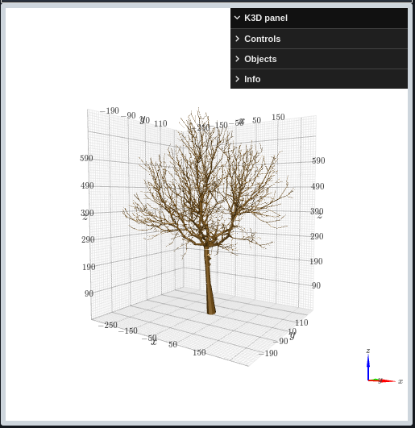

======================================================
Welcome to openalea.widgets's documentation!
======================================================

widgets is a set of OpenAlea widgets for jupyter notebooks allowing to:

    - use a magic to use LPy language
    - display interactive 3D plant architectures, using openalea.plantgl
    - display MTG to explore for instance class and number of vertices, number of scales, properties, using Pyvis

.. toctree::
   :maxdepth: 1

   Home <self>
   readme
   gallery
   authors
   license

.. seealso::

   More documentation on OpenAlea can be found on the
   `OpenAlea <https://openalea.readthedocs.io>`__ website.

Indices and tables
==================

* :ref:`genindex`
* :ref:`modindex`
* :ref:`search`
